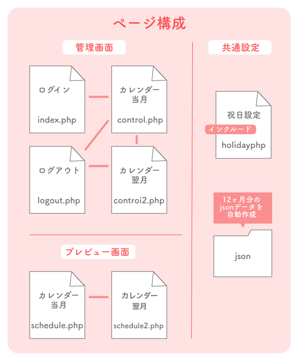

# calender
## スケジュール帳
|格納ファイル&フォルダ |ページor機能
|--|--
|index.php |ログイン
|control.php |管理画面当月入力
|control2.php |管理画面次月入力
|holiday.php |共通インクルード祝日設定
|logout.php |ログアウト
|schedule.php |表示ページ当月
|schedule2.php |表示ページ次月
|common |CSSと画像の格納フォルダ
|json |12ヶ月分のデータ格納フォルダ
 

### 概要

 
- 管理画面で一ヶ月分のスケジュールを書き込む
- 管理画面はログイン形式
- プレビューは表示のみ
- 祝日は手動で入力
- 入力したデータはjsonへ月ごとに格納
- 12ヶ月のjsonは毎年使い回す
  
CSS次第でサイトへ組込みを想定しています。 
店舗や企業などのシフト・営業案内に使用できると思い作りました。 管理画面から入力できればFTPを使わず更新できて便利かなと。
  
※カスタマイズOKです。ただし不具合が起きましたら自己責任でお願いします。  
### DEMOサイト
https://gallery.okamechan.com/my_calender/schedule.php
 
※表示用ページです。
